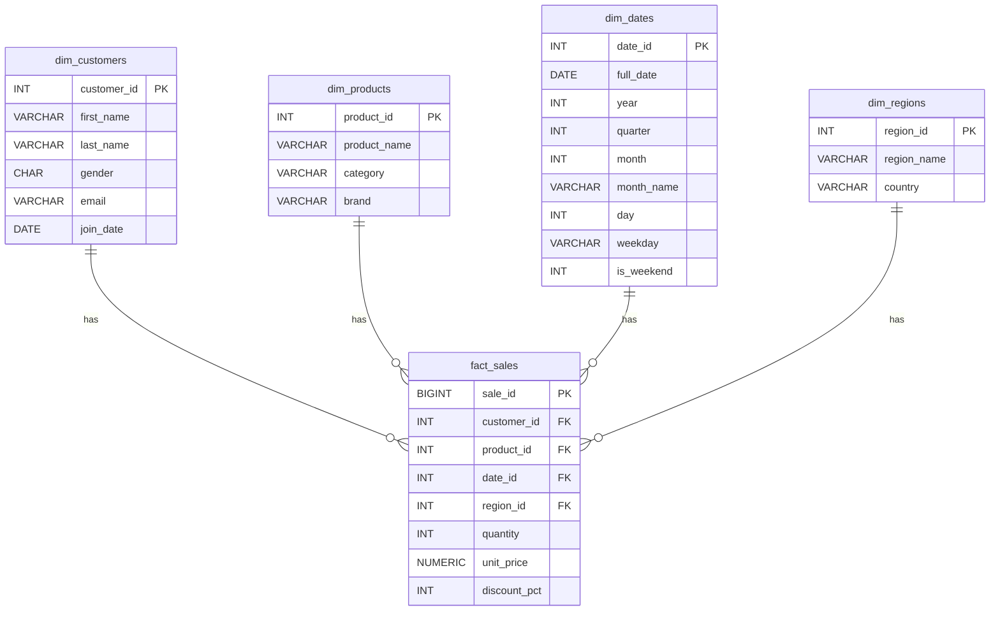

# E-Commerce Analytics — Advanced Data Modeling (PostgreSQL)

End-to-end **star schema** data modeling project for an e-commerce analytics use-case.
Includes schema, synthetic data, performance tuning, materialized views, and example analytics.
Ready to run locally (Docker) or with psql. Perfect for portfolio/GitHub.

## 🧱 Tech
- PostgreSQL 16
- SQL (star schema, window functions, materialized views)
- Docker Compose (optional, for one-command spin-up)

## 📂 Repository Structure
```text
data/                     # CSV source data
docker/
  docker-compose.yml
  init/                   # SQL auto-run at container start
sql/
  01_schema.sql
  02_load_data.sql
  03_indexes.sql
  04_materialized_views.sql
  05_analytics.sql
scripts/
  run_analytics.sh
README.md
LICENSE
```

## 🧠 Business Case
You are the data engineer building a warehouse for an e-commerce company. The goal is to support KPIs such as:
- Revenue by category/region/month
- Top products and customer segments
- Basket size distribution
- Growth trends

## ⭐ Data Model
Star schema with one fact and four dimensions.



## 🚀 Quick Start (Docker)
1. Ensure Docker is installed.
2. From the `docker/` folder run:
   ```bash
   docker compose up -d
   ```
   This starts Postgres and auto-runs:
   - `01_schema.sql`
   - `02_load_data.sql` (uses `\copy` from `/data`)
   - `03_indexes.sql`
   - `04_materialized_views.sql`

3. Connect with your SQL client to `localhost:5432` (user: `postgres`, password: `postgres`).

4. Run example analytics (optional):
   ```bash
   psql -h localhost -U postgres -d postgres -f sql/05_analytics.sql
   ```

## 🖥️ Run with local psql (No Docker)
```bash
psql -U postgres -d postgres -f sql/01_schema.sql
psql -U postgres -d postgres -f sql/02_load_data.sql   # uses \copy with relative ./data paths
psql -U postgres -d postgres -f sql/03_indexes.sql
psql -U postgres -d postgres -f sql/04_materialized_views.sql
psql -U postgres -d postgres -f sql/05_analytics.sql
```

> If `\copy` complains about file paths, run from repo root so `./data/*.csv` resolves.

## 📊 What to Showcase in Interviews
- **Modeling choices**: Star schema, surrogate keys, date dimension
- **Performance**: Indexes + materialized views for dashboard speed
- **SQL depth**: Window functions, aggregations, bucketing
- **Data quality**: Types, constraints, referential integrity

## 🔧 Customization Ideas
- Add `fact_returns`, `fact_web_events`
- Slowly Changing Dimensions (Type 2) for `dim_products`
- Partition `fact_sales` by month
- Expose this in a BI tool (Power BI/Metabase)

## 📝 License
MIT — free to use and modify.
```
